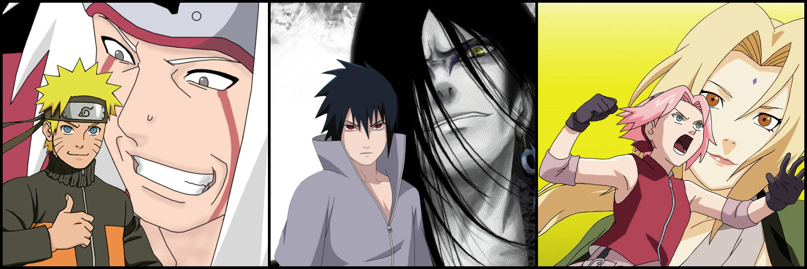

<p align="center">
  
</p>

<h1 align="center">🌀 Shinobi Legends UI</h1>

<p align="center">
  A cinematic Naruto-inspired animated landing page built with modern web animation tools.
</p>

<p align="center">
  <a href="https://shinobi-legends-ui.netlify.app">
    
  </a>
  
  
</p>

---

## 🎬 Preview

<p align="center">
  
</p>

---

## ⚡ About the project

This project is a UI/animation experiment inspired by the Naruto universe.

The goal was to create a **cinematic hero section** with:

* layered text transitions
* smooth GSAP animations
* interactive click-based storytelling
* WebGL-powered distortion effects

Click anywhere on the screen to cycle through different shinobi identities.

---

## 🛠 Tech Stack

<p>
  
</p>

* GSAP
* Shery.js
* Three.js

---

## 📁 Project Structure

```id="c5q2r1"
shinobi-legends-ui/
├── assets/
├── font/
├── index.html
├── style.css
├── script.js
```

---

## 🚀 Run Locally

```bash id="k92m2a"
git clone https://github.com/ashishbtech/shinobi-legends-ui.git
cd shinobi-legends-ui
```

Open `index.html` in your browser.

---


## 🎯 Future Improvements

* Mobile responsiveness
* Scroll-based animations
* Sound design
* More character sections

---

## 📜 License

MIT License © 2026 Ashish

---

<p align="center">
  If you like this project, consider giving it a ⭐
</p>
